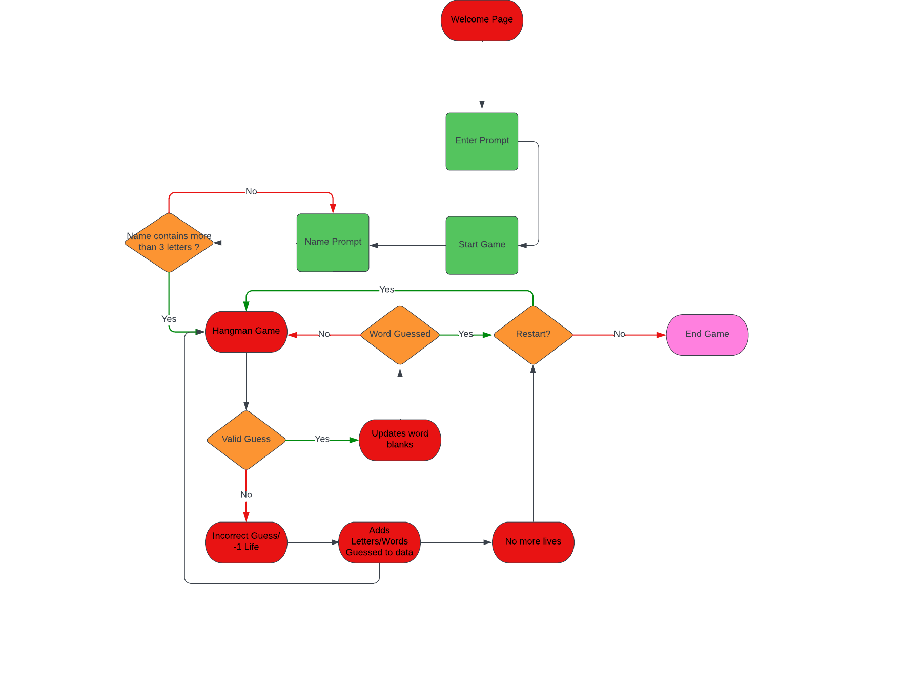
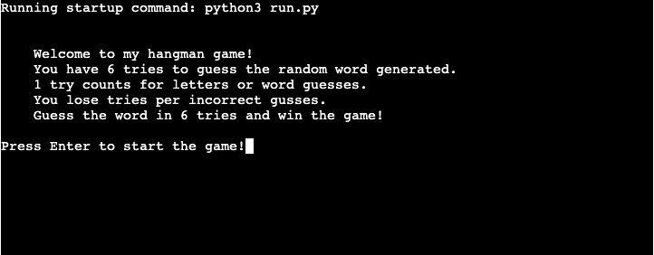
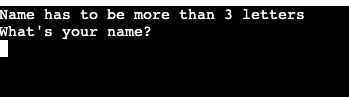
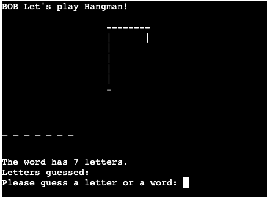
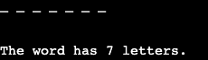
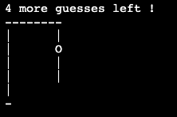
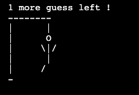
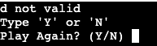
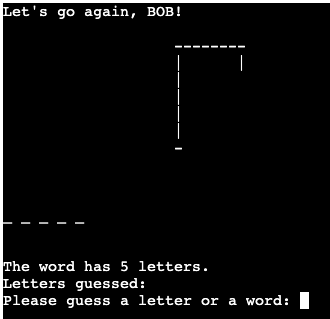

# __Hangman - Portfolio Project 3__

Welcome to my 3rd Project for Code Institute, this project consist of solely Python to which i created a Hangman game! The project is deployed through [Heroku](https://heroku.com/).

From the start, it will give an brief introduction letting the user know what the game is about, showing them brief rules of the game. To then the player is prompt to press "Enter" to start the game; this will then prompt the user for their name to start the game.

The game consists of 6 tries, every letter or word guesses will lower the tries you have for the game. After 6 tries being used and you do not guess the word you will lose the game, though if you were succesful during the 6 tries and managed to guess the word then you win the game!

The deployed project can be found here - [Hangman](https://project-3-hangman-ci.herokuapp.com/)

## __Table of Contents__
- [UX & Design](#ux--design)
    - [User Stories](#user-stories)
- [Flowchart](#flowchart)
- [Features](#features)
    - [Landing Page](#landing-page)
    - [Player Name](#player-name)
    - [Hangman Game](#hangman-game)
    - [Word Length](#word-length)
    - [Letters Guessed](#letters-guessed)
    - [Word Guess](#word-guess)
    - [Tries](#tries)
    - [No more tries](#no-more-tries)
- [Testing](#testing)
- [Bugs](#bugs)
- [Features to Implement](#features-to-implement)
- [Deployment](#deployment)
    - [Heroku Deployment](#heroku-deployment)
- [Credits](#credits)

## __UX & Design__

### __User Stories__
- As a user, I want to be able to know the rules of the game before starting so that I know what to do.
- As a user, I want to be able to input my name and be given feedback for invalid data.
- As a user, I want to know how many letters the word contains to be able to have better choices for my guesses.
- As a user, I want to see what letters I have already used to guess so that I do not input the same letter again; if i do then i want to be prompt for invalid data.
- As a user, I want to know how many tries I have left and a clear visual of the hangman so that i know how many guesses i have left.
- As a user, I want to be able to restart the game with ease so that I do not have to refresh/run the game again.

### __Flowchart__

I made a flowchart for the project so that i can follow clearly what i wanted implemented during the creation proccess. It also shows the path the computer will go through when asking the user for input and when they give invalid data.

This was done on [LucidChart](https://www.lucidchart.com/)

## __Features__

### __Landing Page__
- This will be the first thing the user will see giving them a clear indication on how the game works. When the "Enter" key is pressed it will start the game.

### __Player Name__
- After pressing "Enter" on the landing page, you will be taken here to start the game. You can choose a name which will be used to give you feedback throughout the game.

- However, i put a feature that the name has to be more than 3 letters for the name to be valid. If you put a name under the required letters you will get this prompt, and will be asked to input your name again this will loop until your chosen name passes the criteria.

### __Hangman Game__
- After choosing a name, the game will start this is the layout of the game. It also uses your chosen name to welcome you into the game shown at the top of the terminal.

### __Word Length__
- This feature shows you how long the word is, this will change every game as the word is randomly generated. Also the "_" will change depending on the length of the word.

### __Letters Guessed__
- This feature shows you what letter you have already guessed that is NOT in the word.

- If you guess the same letter, it will not consume a try but it will give you a prompt saying you've used that letter already.

### __Word Guess__
- You can also guess the word fully if you guess wrong you will lose a try, although the word guess has to be the length of the word or you will get this prompt:

### __Tries__
- When you input incorrect guesses, your tries will decrement by 1 and this feature will show you how many tries you have left it also shows the graphic image of the hangman.

 

### __No more tries__
- If you are not succesful with guessing the word, you will lose the game and will be given the chance to restart the game.

- Only "Y" or "N" is a valid input, if you enter a letter other than that you will get this input:

- If you input "N" the game will end, and you will get this prompt:

- If you input "Y" the game will restart from the beginning with a new random word. You can notice the difference as at the top of the terminal it will say "Lets go again, {player name}"

## __Testing__
Testing can be found [here.](TESTING.md)

## __Bugs__
There are no known bugs at the moment.

## __Features to Implement__
- Add colour to the game to make it more appealing
- Add a leaderboard system so that the user can see their scores compared to others

## __Deployment__

### __Heroku Deployment__
This project was deployed using [Heroku](https://heroku.com/).

To be able to deploy using Heroku follow these steps:
- On the right click on _New_
- From the drop down click on _Create New App_
- Input the name for your app (app name has to be unique so use wisely!)
- Choose a region and then click on _Create App_
- From the tabs on _Settings_ screoll down to find _Buildpacks_
- Click on _Add buildpack_
- Choose to add _python_ and _node.js_
- _Python_ has to be at the top of this list and _Node.js_ second, if not then just drag either of them to the correct order.
- From the tabs on _Deploy_ scroll down to find _Deployment method_
- Click on _GitHub_ and connect
- Find the repository name of your project on Github
- Once connected, You can choose from _Automatic Deployment or Manual Deployment_

Note that if your code had private information that you did not want to push to github, you must add this information for your app to be succesfully deployed

- From _settings_ find _config vars_ 
- Click on _reveal config vars_
- Then add the _KEY_ and _VALUE_

## __Credits__
- [LucidChart](https://www.lucidchart.com/) - For making the flow chart
- [Heroku](https://heroku.com/) - For deployment of the app
- [CI Python Linter](https://pep8ci.herokuapp.com/) - For validating my code

