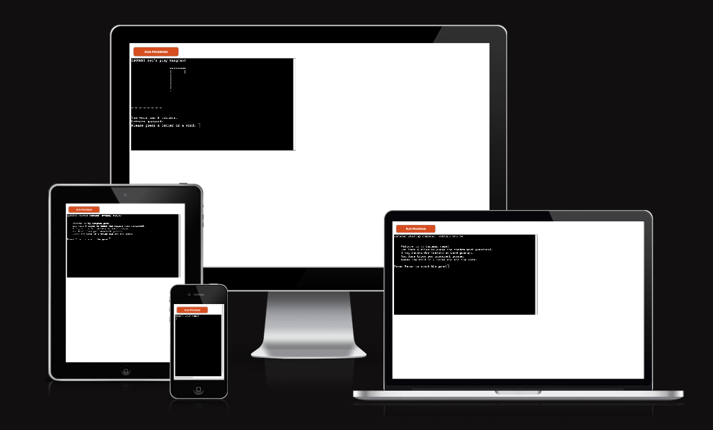

# __Hangman - Portfolio Project 3__

Welcome to my 3rd Project for Code Institute, this project consist of solely Python to which i created a Hangman game! The project is deployed through [Heroku](https://heroku.com/).

From the start, it will give an brief introduction letting the user know what the game is about, showing them brief rules of the game. To then the player is prompt to press "Enter" to start the game; this will then prompt the user for their name to start the game.

The game consists of 6 tries, every letter or word guesses will lower the tries you have for the game. After 6 tries being used and you do not guess the word you will lose the game, though if you were succesful during the 6 tries and managed to guess the word then you win the game!

The deployed project can be found here - [Hangman](https://project-3-hangman-ci.herokuapp.com/)

## __UX & Design__

### __User Stories__
- As a user, I want to be able to know the rules of the game before starting so that I know what to do.
- As a user, I want to be able to input my name and be given feedback for invalid data.
- As a user, I want to know how many letters the word contains to be able to have better choices for my guesses.
- As a user, I want to see what letters I have already used to guess so that I do not input the same letter again; if i do then i want to be prompt for invalid data.
- As a user, I want to know how many tries I have left and a clear visual of the hangman so that i know how many guesses i have left.
- As a user, I want to be able to restart the game with ease so that I do not have to refresh/run the game again.

### __Flowchart__

I made a flowchart for the project so that i can follow clearly what i wanted implemented during the creation proccess. It also shows the path the computer will go through when asking the user for input and when they give invalid data.

## __Features__

