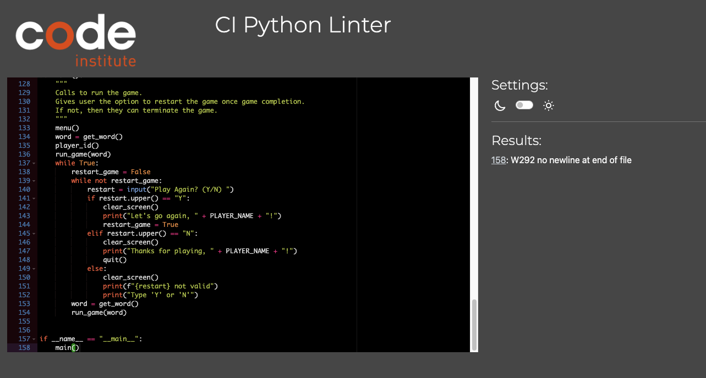
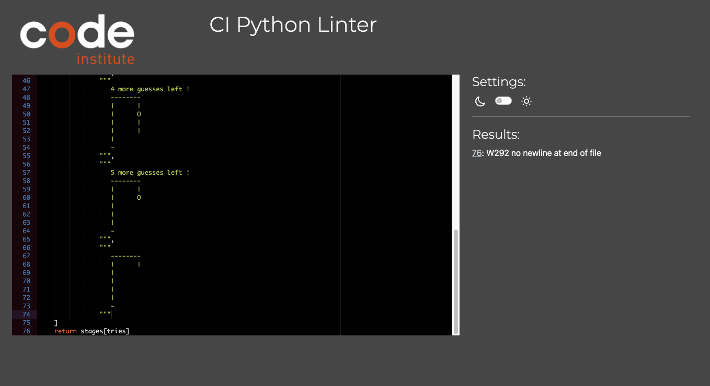

# __Testing__
I put my code from run.py and graphics.py in [CI Python Linter](https://pep8ci.herokuapp.com/) to make sure that my code had no errors the results are shown below:

### __Run.py__

### __Graphics.py__
