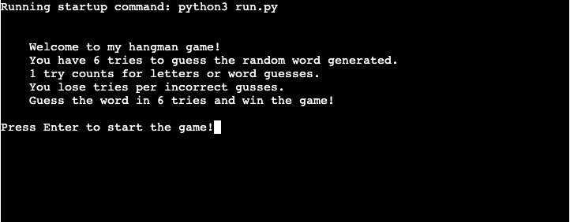
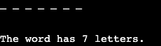

# __Testing__
I put my code from run.py and graphics.py in [CI Python Linter](https://pep8ci.herokuapp.com/) to make sure that my code had no errors the results are shown below:

### __Run.py__

### __Graphics.py__

## __User Stories Testing__

| User Goal | Requirements Met | Image(s) |
|-----------|------------------|----------|
|As a user, I want to be able to know the rules of the game before starting so that I know what to do.|Yes||
|As a user, I want to be able to input my name and be given feedback for invalid data.|    Yes| |
|As a user, I want to know how many letters the word contains to be able to have better choices for my guesses.|Yes| |
|As a user, I want to see what letters I have already used to guess so that I do not input the same letter again; if i do then i want to be prompt for invalid data.|Yes|  |
|As a user, I want to know how many tries I have left and a clear visual of the hangman so that i know how many guesses i have left.|Yes||
|As a user, I want to be able to restart the game with ease so that I do not have to refresh/run the game again.|Yes||